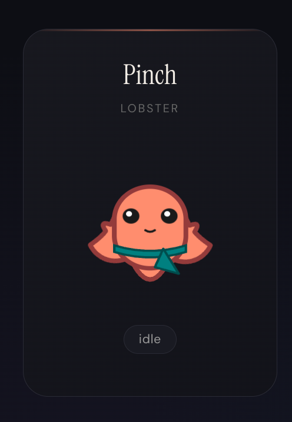
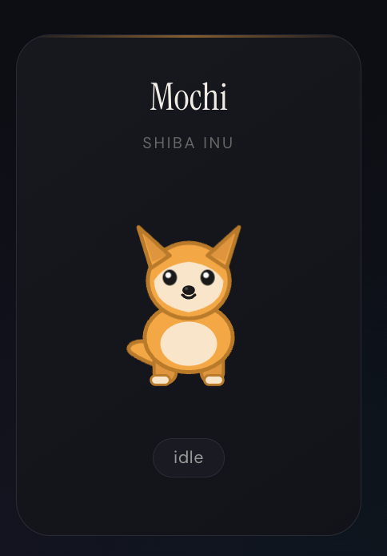
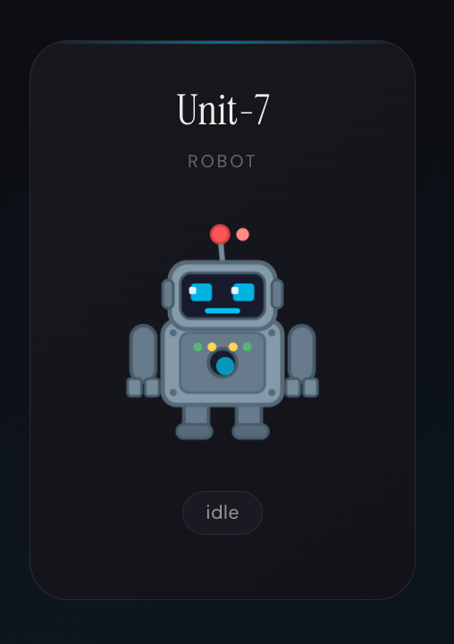
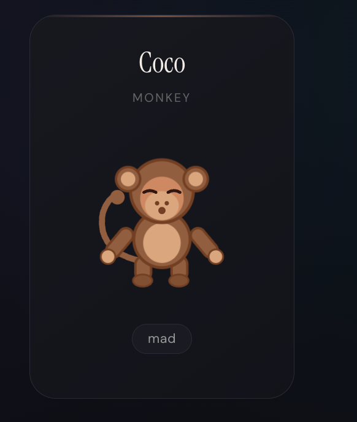

# Tomo

Your AI assistant, alive on your screen.

Tomo is a collection of animated desktop pet characters designed to be the visual face of your [OpenClaw](https://github.com/openclaw/openclaw) AI assistant. Instead of chatting with a text box, you talk to a living, expressive companion that reacts to your conversations, moves around your desktop, and shows real personality.

> **Status:** This is **Phase 1** — the character animation system. Integration with the [OpenClaw](https://github.com/openclaw/openclaw) assistant runtime is coming next. Right now you get fully animated, interactive characters ready to be wired into the OpenClaw gateway.


---

## Meet the Characters

Pick who you want living on your screen.

| | Name | What makes them tick |
|:-:|:----:|:-----|
| 🦞 | **Pinch** | A salmon-colored lobster with snipping claws and a teal belt. The original. Waddles when walking, waves claws when happy, floats Z's when sleeping. |
| 🐕 | **Mochi** | A Shiba Inu with independently twitching ears, a wagging tail, and tongue-out grins. Droopy ears when worried, full-body tippy-taps when excited. |
| 🤖 | **Unit-7** | A robot with LED eyes that shift color by mood — blue for calm, green for happy, red for angry, purple for proud. Pulsing power core and spark effects. |
| 🐒 | **enzo** | A monkey with a curling prehensile tail, long clapping arms, and floating banana effects. Arms cross when mad, tail thumps when annoyed. |

Every character supports the full mood system: idle, happy, sleeping, curious, worried, walking, proud, spin, startle, and mad — plus idle micro-behaviors like blink, look around, stretch, wiggle, and yawn.

Want to build your own? See [Contributing a Character](#contributing-a-character) below.

### Character Showcase

| Pinch | Mochi | Unit-7 | enzo |
|:-----:|:-----:|:------:|:----:|
|  |  |  |  |
| 🦞 Lobster | 🐕 Shiba Inu | 🤖 Robot | 🐒 Monkey |

---

## How It Works

Each character is a **hand-drawn inline SVG** with named body part groups, animated entirely with **CSS keyframes** and **React state**. No sprite sheets, no Lottie, no canvas.

```
SVG (named parts: body, arms, eyes, mouth, tail, effects)
  → React state machine (mood + idle behavior)
    → CSS class toggling (state-happy, state-walking, idle-yawn, ...)
      → @keyframes on individual body parts
```

Characters are lightweight, scalable to any size, and trivial to customize. The entire system with all five characters and full animation is around 1200 lines.

---

## OpenClaw Integration

Tomo is designed to merge with [openclaw/openclaw](https://github.com/openclaw/openclaw) — the open-source personal AI assistant. OpenClaw handles the brain (multi-channel messaging, agent runtime, tools, skills). Tomo gives it a body.

**What exists now (this repo):**
- Full character animation system with mood state machine
- Electron desktop pet window (transparent, always-on-top, draggable)
- Chat popup and quick-reply UI
- Screenshot question capture
- Onboarding wizard with workspace and personality setup
- Connects to the OpenClaw gateway API for chat completions

**What's next (the merge):**
- Character selection during onboarding — pick your Tomo
- Mood inference from agent responses — the assistant's tone drives your character's expression automatically
- Action commands in agent responses (`set_mood`, `move_to`, `move_to_cursor`) so the assistant can physically react
- Per-channel character assignment — different Tomos for different workspaces or agents
- Community character contributions via the template system
- ClawHub skill for character-aware responses

The architecture is ready. Each character has `IDENTITY.md` and `SOUL.md` files that define personality for OpenClaw's agent runtime. Your Tomo doesn't just look different — it speaks and behaves differently too.

---

## Getting Started

### Prerequisites

- **Node.js** 18+
- **OpenClaw** — Install and set up [OpenClaw](https://openclaw.ai) with the gateway running locally

### Install

```bash
git clone https://github.com/wuyuwenj/tomo.git
cd tomo
npm install
npm run dev
```

On first launch, the onboarding wizard walks you through workspace selection, gateway connection, personality customization, and hotkey setup.

### Keyboard Shortcuts

| Shortcut | Action |
|----------|--------|
| `Cmd+Shift+Space` | Open quick chat bar |
| `Cmd+Shift+/` | Screenshot + question |
| `Cmd+Shift+A` | Toggle full assistant panel |
| `Esc` | Close chat bar |

---

## Animations

Pinch the lobster (the original character) animations:

| Idle | Happy | Sleep | Startle |
|:----:|:-----:|:-----:|:-------:|
|  |  |  |  |
| Breathing & blinking | Bouncing with joy | Zzz... | Surprised! |

| Doze | Side-Eye | Crossed | Huff |
|:----:|:--------:|:-------:|:----:|
|  |  |  |  |
| Getting sleepy... | Judging you | Arms crossed | Steaming mad |

| Proud | Peek | Spin | Walking |
|:-----:|:----:|:----:|:-------:|
|  |  |  |  |
| Feeling accomplished | Curious peek | Celebratory spin | Scuttling around |

---

## Project Structure

```
tomo/
├── src/
│   ├── main/                    # Electron main process
│   │   ├── main.ts              # App entry, windows, IPC
│   │   ├── clawbot-client.ts    # OpenClaw gateway client
│   │   ├── watchers.ts          # App/file activity watchers
│   │   └── store.ts             # Persistent settings
│   └── renderer/                # Frontend (React + Vite)
│       ├── pet/                 # Character components
│       │   ├── Pet.tsx          # SVG characters + state machine
│       │   └── styles.css       # All animation keyframes
│       ├── chatbar/             # Quick chat overlay
│       ├── pet-chat/            # Chat bubble above character
│       ├── assistant/           # Full assistant panel
│       ├── screenshot-question/ # Screen capture Q&A
│       └── onboarding/          # First-launch wizard
├── characters/                  # Character definitions
│   ├── pinch/                   # Lobster
│   │   ├── IDENTITY.md
│   │   └── SOUL.md
│   ├── mochi/                   # Shiba Inu
│   ├── unit-7/                  # Robot
│   └── enzo/                    # Monkey
└── package.json
```

---

## Customization

### Choosing a Character

Currently the default character is Pinch the lobster. The new characters (Mochi, Unit-7, enzo) are built and ready — swap the SVG component in `Pet.tsx` to switch. Character selection UI is planned for the onboarding wizard.

### Personality

Each character has its own `IDENTITY.md` (who they are) and `SOUL.md` (how they behave). These files get loaded into the OpenClaw agent runtime, so your Tomo's personality comes through in its actual responses — not just animations.

### Workspace

The onboarding wizard configures your workspace:
- **OpenClaw workspace**: `~/.openclaw/workspace/` (shared with your existing OpenClaw setup)
- **Tomo workspace**: `~/.openclaw/workspace-tomo/` (dedicated, with character personality)

---

## Contributing a Character

The animation system is designed to make adding characters straightforward. Here's the process:

1. **Draw your SVG** — Break the character into named groups: body, head, left-arm, right-arm, eyes (open/closed/squint), mouth variants (neutral/happy/worried), tail or equivalent, and effect layers (hearts, sparks, Z's, etc.)

2. **Set transform origins** — Each group needs a `transform-origin` at the right pivot point (shoulder for arms, base for tail, etc.) so rotations look natural

3. **Write the CSS** — Copy an existing character's CSS block, rename the class prefix (e.g., `.cat-container`), and tune the rotation angles, translation distances, and timing to match your character's proportions

4. **Create a React component** — Follow the `ShibaSvg` / `RobotSvg` / `MonkeySvg` pattern. The component is pure SVG markup with className attributes on each group

5. **Write personality files** — Create `IDENTITY.md` and `SOUL.md` for how the character speaks and behaves as an assistant

6. **Submit a PR**

The React state machine, click handlers, mood system, and idle behavior timers are all character-agnostic. You only touch SVG and CSS.

---

## Development

```bash
npm run dev      # Development mode with hot reload
npm run build    # Production build
npm run dist     # Create distributable package
```

---

## Related

- **[OpenClaw](https://github.com/openclaw/openclaw)** — The AI assistant runtime Tomo integrates with
- **[openclaw.ai](https://openclaw.ai)** — OpenClaw docs
- **[Discord](https://discord.gg/clawd)** — Community

## License

MIT

---

_Tomo (友) — Japanese for "friend."_
